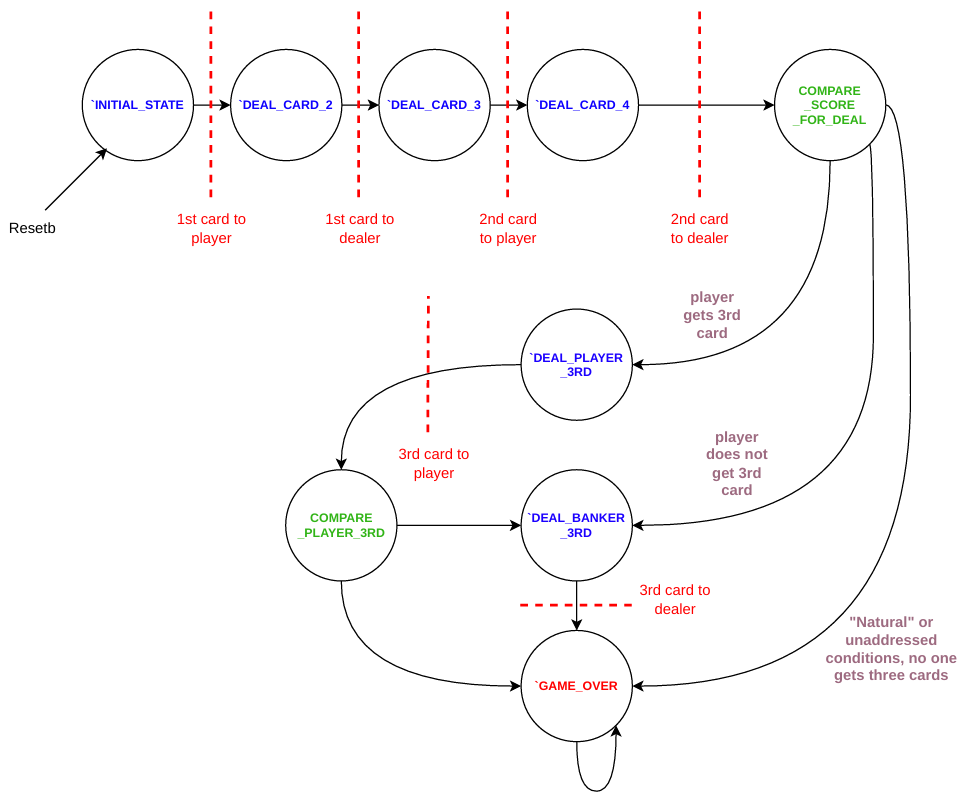
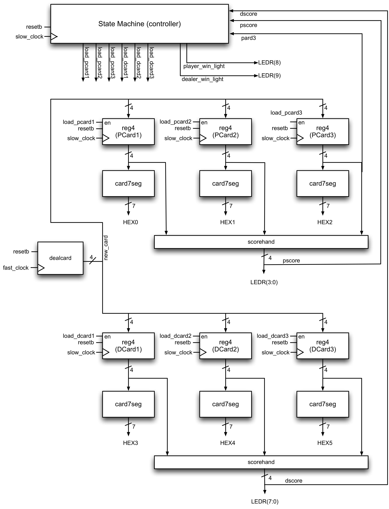

# Baccarat-Engine

## Briefing
Baccarat game implemented in SystemVerilog on a Cyclone V FPGA. Designed by David Tang and Hemat Wander. The version of Baccarat played is Punto Banco. Included in this repo are files for synthesis and testbench files for the engine's implementation. 

## Remarks
While this project is pretty simple, the testbenching was quite rigorous! tb_statemachine.sv written by DT checks for correct state transitions and state outputs under several cases in the rules section.

## Rules
```
1. 2 cards are dealt to both dealer and player each
2. If either have a score of 8 or 9, this is considered a natural and we declare game over (skip to 5.)
3. Else if the player's score is between 0 to 5, player gets a third card.
> if banker's score == 7, banker does not get a third card
> else if banker's score == 6, banker gets a third card if player's third card is a 6 or 7
> else if banker's score == 5, banker gets a third card if player's third card is [4,7]
> else if banker's score == 4, banker gets a third card if player's third card is [2,7]
> else if banker's score == 3, banker gets a third card if player's third card !== 8
> else if banker's score is [0,2], banker gets a third card regardless
4. Else if player's score is between 6 or 7, player does not get a third card
> if the banker's score is [0,5], banker gets a third card
> else Banker does not get a third card
5. Game over. Tabule score and determine victor or tie.
```

## State Machine Diagram
<p align="center">
  All state transitions are reliant on the 'slow_clock', or the KEY0 button on the DE1-SoC
</p>
<p align="center">
  
</p>

## Datapath Diagram
*Sourced from UBC CPEN 311 course materials*
<p align="center">
  
</p>

## DE1-SoC I/O


